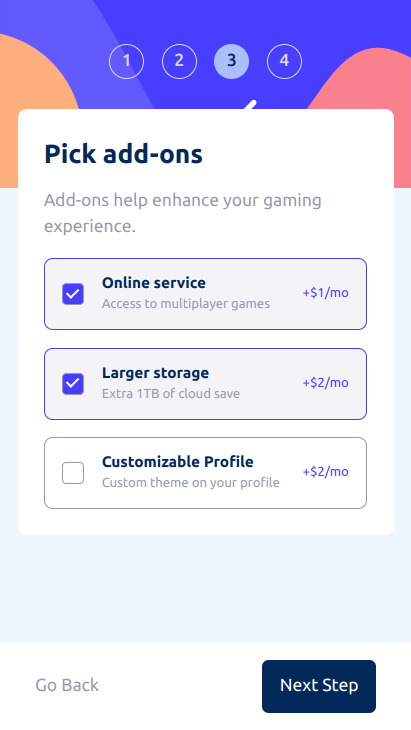

# Frontend Mentor - Multi-step form solution

This is a solution to the [Multi-step form challenge on Frontend Mentor](https://www.frontendmentor.io/challenges/multistep-form-YVAnSdqQBJ). Frontend Mentor challenges help you improve your coding skills by building realistic projects. 

## Table of contents

- [Frontend Mentor - Multi-step form solution](#frontend-mentor---multi-step-form-solution)
  - [Table of contents](#table-of-contents)
  - [Overview](#overview)
    - [The challenge](#the-challenge)
    - [Screenshot](#screenshot)
    - [Links](#links)
  - [My process](#my-process)
    - [Built with](#built-with)
    - [What I learned](#what-i-learned)
  - [Author](#author)

**Note: Delete this note and update the table of contents based on what sections you keep.**

## Overview

### The challenge

Users should be able to:

- Complete each step of the sequence
- Go back to a previous step to update their selections
- See a summary of their selections on the final step and confirm their order
- View the optimal layout for the interface depending on their device's screen size
- See hover and focus states for all interactive elements on the page
- Receive form validation messages if:
  - A field has been missed
  - The email address is not formatted correctly
  - A step is submitted, but no selection has been made

### Screenshot





### Links

- Solution URL: [Github](hhttps://github.com/Hatter-s/multi-step-form-vue)
- Live Site URL: [Netlify](https://hatter-multi-step-form.netlify.app/)

## My process

### Built with

- Semantic HTML5 markup
- CSS custom properties
- tailwind CSS [https://tailwindcss.com/]
- Vue3 js [https://vuejs.org/]
- pinia [https://pinia.vuejs.org/]
- vue-router [https://router.vuejs.org/]

### What I learned

- Handle pass path src attr of img element via props in vue
```vue
<template>
  <div>
    
  </div>
</template>

<script setup>
const props = defineProps(['imgSrc']);

function getImageUrl() {
  // This path must be correct for your file
  return new URL(`../assets/icons/${props.imgSrc}`, import.meta.url);
}

</script>
```

## Author

- Github - [Thanh Vu](https://github.com/Hatter-s)
- Frontend Mentor - [@Hatter-s](https://www.frontendmentor.io/profile/Hatter-s)
- Twitter - [@ThnhV06299393](https://twitter.com/ThnhV06299393)
